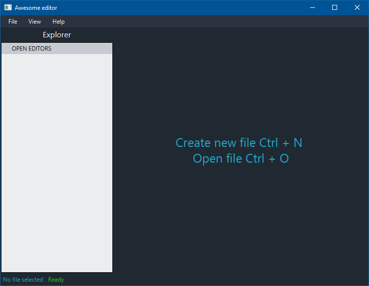
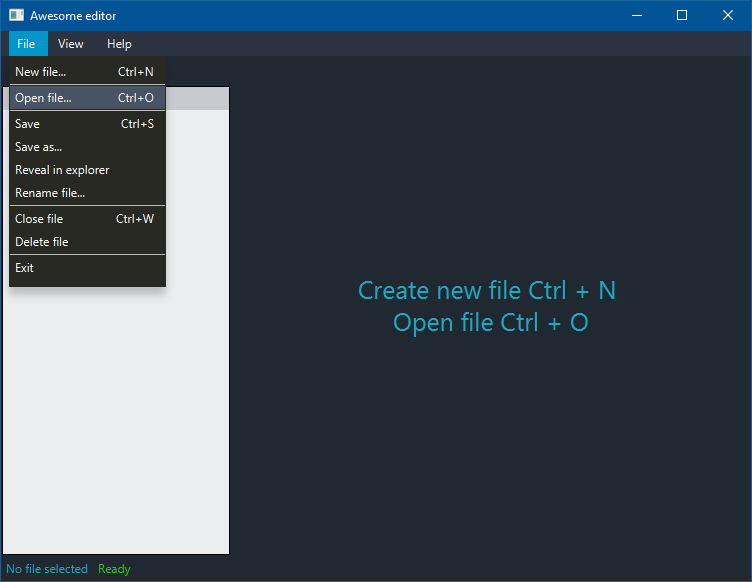
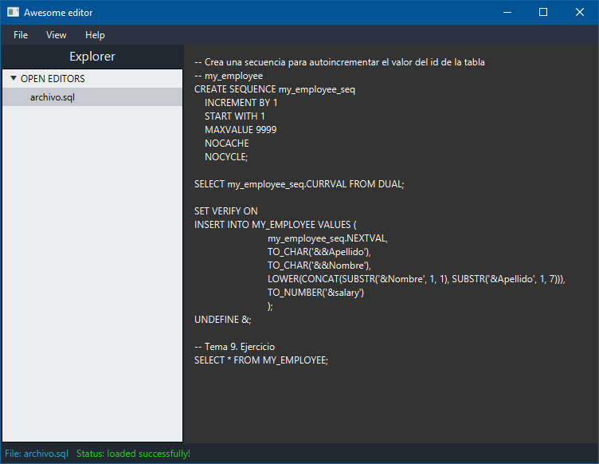

# Awesome editor

"Awesome editor" is a homework scholarly and its purpose is shows a program's input and output flow reading, writing, deleting and renaming files.

This program is written in Java, using JavaFX for UI.

